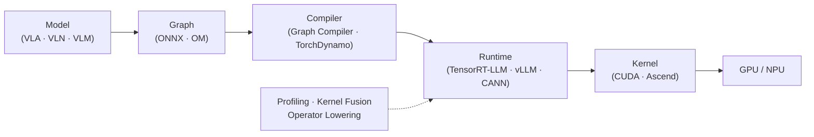

# 👋 Hi, I'm Adlexer

**ADS LLM Infra · Runtime · Deployment**

 

   

---

## 🧭 About

I'm an **Autonomous Driving (ADS) LLM Infra / Deployment algorithm engineer** at **Huawei**, working on the systems behind multimodal foundation models — from **training and model export to graph compilation, inference runtimes, and hardware acceleration**.

---

## 🏢 Huawei · Open Source

I contribute to the **Ascend CANN** ecosystem at Huawei:

- 🏛️ Our Organization — [**gitcode.com/cann**](https://gitcode.com/cann)
- ⚙️ Our Repository — [**cann/ge**](https://gitcode.com/cann/ge) — GE (Graph Engine)
- 🚀 Projects I Contribude — [**cann/cannbot-skills**](https://gitcode.com/cann/cannbot-skills) · [**cann/pypto**](https://gitcode.com/cann/pypto)

---

## 🎯 Focus Areas

- Multimodal LLMs (**VLA / VLN / VLM**) — training, deployment & inference optimization
- LLM **Runtime** · **Inference Engine** · **Graph Compiler**
- **TensorRT-LLM** · **vLLM** · **PyTorch Backend** · **TorchDynamo**
- **Ascend CANN** · **Torch-NPU** · **GE** · **MindSpeed** · **Megatron**
- Model export (**ONNX** / **TRT Engine** / **OM**)
- **Profiling** · **Kernel Fusion** · **Operator Lowering**
- **CI/CD** · automation pipelines · **Agent Workflow**

## 🔭 Currently Exploring

- TensorRT-LLM Runtime Architecture
- Runtime-first inference framework design
- Ascend inference optimization
- Qwen3VL / Pangu / VLA deployment
- Agent Skill Engineering
- LLM Infra automation

## 🛠️ Stack

  
  
  
  
  
  

- **Frameworks:** PyTorch · Transformers · TensorRT-LLM · vLLM · CANN · Torch-NPU · Megatron · MindSpeed · ms-swift
- **Interests:** AI Infra · Inference Runtime · Compiler · GPU/NPU · Autonomous Driving · Agent · Software Architecture

---

## 📈 GitHub Stats

<!--
  github-readme-stats (503) and github-readme-activity-graph (402) were temporarily
  down when this was written (2026-08-27). Uncomment once they are back up:

  
  
  
-->

---

AI systems, one layer below the model.

    
    

